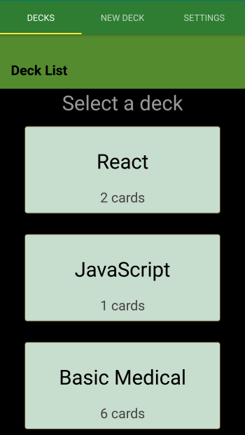

# swUdaciCards
> A basic Flashcard App built using React-Native and Expo


Flashcard program to help users memorize new vocabulary or concepts.
This project was developed in order to learn more about the react native and expo
built tools. It is also a Udacity NanoDegree requirement which described the basic
layout and functionality of this application.

This application was initially created using expo-cli and selecting the tabs
template.

### Storage details
  Runtime storage is implemented using Redux.
  Permanent Storage is implemented using AsyncStorage. This is also updated at
  runtime. This is not the most efficient method to update. Would have been
  simpler to only update Redux at runtime and then store updates to AsyncStorage
  on save.



## Installation

This application has only been tested on Android hardware with the following
specifications
  * Android version : 6.0.1
  * Device: Samsung Galaxy S5, Model number SM-G906S
  * Expo Client Version: 2.10.6

 Expo client(https://play.google.com/store/apps/details?id=host.exp.exponent)
 (npm install expo-cli --global)

Windows OS X & Linux:

Clone repo to your machine with yarn installed.
From the command line run the following commands.

```sh
yarn install

yarn start
```
From here you should see the Expo CLI. If successful Expo will prompt you to
either  -
  * scan the QR code using the Expo client on your android device.
  * or email a link to your device.


## Usage example

 Create a Flashcard deck to help memorize new information.
 Regularly retest to ensure you have memorized the information.


## Release History

* 1.0.0
    * Work in progress

## Meta

ScottyNZ

Distributed under the MIT license. See ``LICENSE`` for more information.

[https://github.com/ScottyNZ/swUdaciCards](https://github.com/ScottyNZ/)


