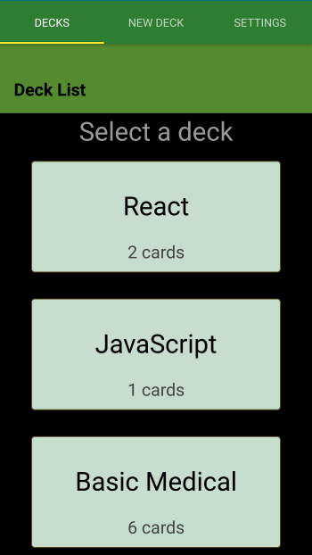

# swUdaciCards
> A basic Flashcard App built using React-Native and Expo

[![NPM Version][npm-image]][npm-url]

Flashcard program to help users memorize new vocabulary or concepts.
This project was developed in order to learn more about the react native and expo
built tools. It is also a Udacity NanoDegree requirement which described the basic
layout and functionality of this application.



## Installation

OS X & Linux:

```sh
yarn install
```


## Usage example

 Create a Flashcard deck to help memorize new information.
 Regularly

_For more examples and usage, please refer to the [Wiki][wiki]._

## Release History

* 0.0.1
    * Work in progress

## Meta

Scott Wear – scotwear@gmail.com

Distributed under the MIT license. See ``LICENSE`` for more information.

[https://github.com/ScottyNZ/github-link](https://github.com/ScottyNZ/)

## Contributing

1. Fork it (<https://github.com/yourname/yourproject/fork>)
2. Create your feature branch (`git checkout -b feature/fooBar`)
3. Commit your changes (`git commit -am 'Add some fooBar'`)
4. Push to the branch (`git push origin feature/fooBar`)
5. Create a new Pull Request

<!-- Markdown link & img dfn's -->
[npm-image]: https://img.shields.io/npm/v/datadog-metrics.svg?style=flat-square
[npm-url]: https://npmjs.org/package/datadog-metrics
